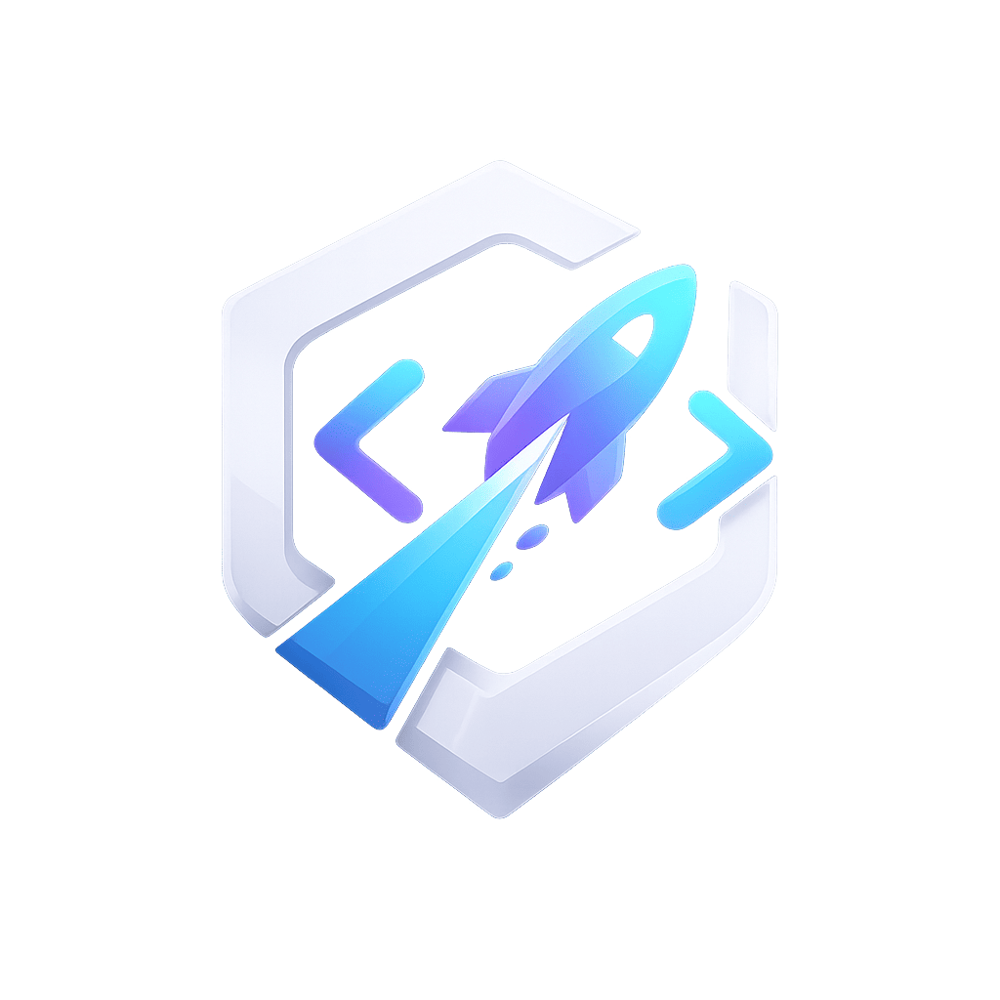
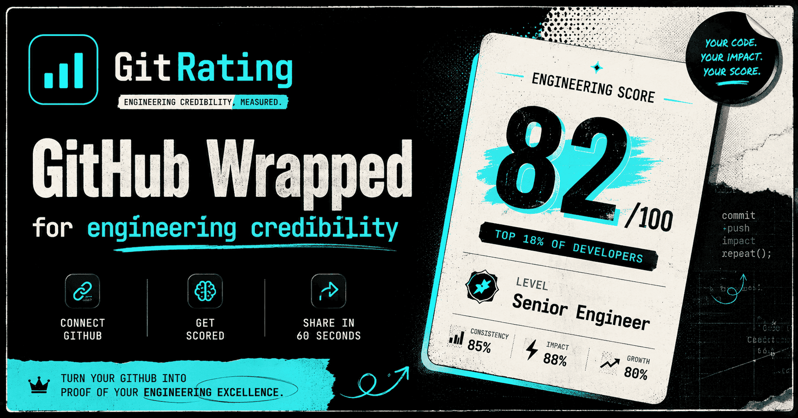

<div align="center">


### GitHub Wrapped for Engineering Credibility

Connect your GitHub, get a shareable **Engineering Score** in 60 seconds —
with full evidence, skill radar, and actionable gaps.

[](https://devscope.mozen.in)
[](LICENSE)
[](#contributing)

<br/>



</div>

---

## What is GitRating?

> Everyone's a "10x engineer" on LinkedIn. Let's check GitHub.

GitRating analyzes your **public GitHub repositories** and produces a credible, defensible Engineering Score — not vanity metrics like commit counts and star totals, but real signal about your **architecture, backend, frontend, code quality, testing, security, DevOps, documentation, maintainability, and complexity judgment**.

Every score comes with **evidence cited to actual repos** — no black box, no guessing.

<div align="center">

</div>

---

## Features

| Feature | What it does |
|---------|-------------|
| **Engineering Score** | 0–100 score across 10 axes with full AI analysis |
| **Skill Radar** | Visual radar chart — Architecture, Backend, Frontend, Code Quality, Testing, Security, DevOps, Docs, Maintainability, Complexity & Judgment |
| **Language Capabilities** | Byte-weighted language breakdown from your repos |
| **Public Profile** | Shareable `/u/{username}` URL with your score |
| **PDF Report** | Downloadable report with per-axis breakdowns |
| **Quick Compare** | Head-to-head battle — compare up to 4 profiles, no login needed |
| **Leaderboard** | Location-based rankings — city, state, or country |
| **Activity Log** | Full transparency — every GitHub API call and score run logged |
| **Improvement Impact** | See projected score gains per axis — Now → Potential |
| **Share Card** | Auto-generated OG image for social sharing |

---

## How It Works

```
1. CONNECT     → One GitHub OAuth click (public repos only)
2. SYNC        → GitRating fetches repos, languages, README, topics
3. SCORE       → AI analyzes 10 skill axes with cited evidence
4. SHARE       → Get a shareable score card (auto-generated OG image)
5. IMPROVE     → See exactly what's holding you back, with evidence
```

---

## Tech Stack

<table>
<tr>
<td><b>Frontend</b></td>
<td>Next.js 15 (App Router), React 19, TypeScript, Tailwind CSS v4</td>
</tr>
<tr>
<td><b>Design</b></td>
<td>Neobrutalist — hard shadows, paper/ink/cyan palette, Space Grotesk + Inter + JetBrains Mono</td>
</tr>
<tr>
<td><b>Auth</b></td>
<td>Better Auth + GitHub OAuth</td>
</tr>
<tr>
<td><b>Database</b></td>
<td>PostgreSQL (Neon) + Prisma ORM</td>
</tr>
<tr>
<td><b>Cache</b></td>
<td>Upstash Redis (REST, serverless) with in-memory fallback</td>
</tr>
<tr>
<td><b>AI</b></td>
<td>OpenRouter (model-tiered) + ZenMux (free tier fallback)</td>
</tr>
<tr>
<td><b>Charts</b></td>
<td>Recharts (radar) + custom neobrutalist bars</td>
</tr>
<tr>
<td><b>Animations</b></td>
<td>Framer Motion + Lenis smooth scroll</td>
</tr>
<tr>
<td><b>OG Images</b></td>
<td>@vercel/og (Satori) — auto-generated per-user score cards</td>
</tr>
<tr>
<td><b>Rate Limiting</b></td>
<td>Upstash Ratelimit (sliding window) + in-memory fallback</td>
</tr>
<tr>
<td><b>Deployment</b></td>
<td>Vercel</td>
</tr>
</table>

---

## Getting Started

### Prerequisites

- [Bun](https://bun.sh) ≥ 1.3
- A [Neon](https://neon.tech) PostgreSQL database
- A [GitHub OAuth App](https://docs.github.com/en/apps/oauth-apps/building-oauth-apps/creating-an-oauth-app)
- An [OpenRouter](https://openrouter.ai) API key (or [ZenMux](https://zenmux.ai) for free tier)
- An [Upstash](https://upstash.com) Redis instance (optional — falls back to in-memory)

### Setup

```bash
# Clone
git clone https://github.com/Abi-de-jo/devscope.git
cd devscope

# Install dependencies
bun install

# Configure environment
cp .env.example .env
# Fill in the required variables (see below)

# Generate Prisma client & push schema
bunx prisma generate
bunx prisma db push

# Start dev server (Windows needs --webpack for SWC)
bun dev --webpack -p 3001
```

Open [http://localhost:3001](http://localhost:3001).

---

## Environment Variables

| Variable | Required | Description |
|----------|----------|-------------|
| `DATABASE_URL` | ✅ | Neon PostgreSQL connection string |
| `BETTER_AUTH_SECRET` | ✅ | Random secret for session encryption |
| `BETTER_AUTH_URL` | ✅ | App base URL (e.g. `http://localhost:3001`) |
| `NEXT_PUBLIC_APP_URL` | ✅ | Public app URL (e.g. `https://devscope.mozen.in`) |
| `GITHUB_CLIENT_ID` | ✅ | GitHub OAuth App client ID |
| `GITHUB_CLIENT_SECRET` | ✅ | GitHub OAuth App client secret |
| `OPENROUTER_KEY_1` | ✅ | OpenRouter API key for AI scoring |
| `OPENROUTER_KEY_2–4` | ⬜ | Optional key rotation for higher limits |
| `GITHUB_TOKEN` | ⬜ | GitHub PAT for compare/leaderboard (5000 req/hr) |
| `UPSTASH_REDIS_REST_URL` | ⬜ | Upstash Redis REST URL |
| `UPSTASH_REDIS_REST_TOKEN` | ⬜ | Upstash Redis REST token |
| `ZENMUX_API_KEY` | ⬜ | ZenMux free-tier AI fallback |

---

## Project Structure

```
src/
├── app/                        # Next.js App Router
│   ├── api/                    # API routes
│   │   ├── score/              # GET/POST — AI score (cached + rate-limited)
│   │   ├── sync/               # POST — GitHub profile sync
│   │   ├── compare/            # POST — Quick compare (no login)
│   │   ├── leaderboard/        # GET — Location-based rankings
│   │   ├── analyses/           # GET — Analysis history
│   │   ├── repositories/       # GET — User repos (language analysis)
│   │   ├── activity-log/       # GET/POST — Transparency log
│   │   └── og/                 # Dynamic OG image generation
│   ├── dashboard/              # Authenticated dashboard
│   ├── battle/                 # Quick Compare page
│   ├── leaderboard/            # Location rankings
│   ├── report/[username]/      # PDF-optimized report
│   ├── u/[username]/           # Public profile
│   ├── about/                  # About page
│   └── how-it-works/           # Feature explanations
├── components/
│   ├── analysis-view.tsx       # Dashboard analysis (ScoreHero + AxisCards)
│   ├── hero-score-card.tsx     # Animated landing page hero card
│   ├── language-capabilities.tsx # Byte-weighted language bars
│   ├── locked-preview.tsx      # Auth-gated content wrapper
│   ├── navigation.tsx          # Nav + mobile modal overlay
│   ├── smooth-scroll.tsx       # Lenis + route-change scroll-to-top
│   └── loaders/                # CenterLoader, skeleton, button-loading
├── lib/
│   ├── redis.ts                # Upstash Redis singleton (lazy)
│   ├── cache.ts                # Dual-layer cache (Redis + in-memory)
│   ├── rate-limit.ts           # Sliding-window rate limiter
│   ├── auth.ts                 # Better Auth config
│   ├── auth-client.ts          # Client-side auth helpers
│   ├── db.ts                   # Prisma client
│   ├── errors.ts               # Friendly error toast system
│   ├── activity-log.ts         # Sanitized transparency logging
│   ├── github.ts               # GitHub API + caching
│   ├── compare-engine.ts       # Quick-score engine (6 categories)
│   ├── leaderboard.ts          # Location search + composite ranking
│   └── location-data.ts        # City/state/country lookup data
├── server/
│   └── scoring.ts              # AI scoring (10 axes, ZenMux + OpenRouter)
└── data/
    └── hero-profile.json       # Static hero snapshot (seeded)
```

---

## Architecture

```
┌─────────────┐    ┌──────────────┐    ┌─────────────┐
│   Browser    │───▶│  Next.js API  │───▶│  Neon DB    │
│              │    │  (Vercel)     │    │ (Postgres)  │
└─────────────┘    └──────┬───────┘    └─────────────┘
                          │
                ┌─────────┼─────────┐
                │         │         │
          ┌─────▼───┐ ┌───▼────┐ ┌──▼──────┐
          │ Upstash  │ │GitHub  │ │OpenRouter│
          │ Redis    │ │  API   │ │  / ZenMux│
          │ (cache)  │ │(repos) │ │  (AI)    │
          └─────────┘ └────────┘ └─────────┘
```

**Data flow:**
1. User clicks "Connect GitHub" → OAuth → profile + repos synced to Neon DB
2. Dashboard loads → score served from Redis cache (10 min TTL) or fresh from DB
3. First score → AI analyzes repos across 10 axes → result cached in Redis (24h)
4. Compare/Battle → GitHub metadata scored locally (no AI cost) → cached per-user (24h)
5. Leaderboard → GitHub search → composite ranking → cached per-location (36h)

---

## Design System

Neobrutalist print-editorial aesthetic — inspired by [karolbinkow.ski](https://karolbinkow.ski):

| Token | Value | Usage |
|-------|-------|-------|
| `--paper` | `#F5F4F0` | Page background |
| `--ink` | `#0B0C0E` | Text, borders, shadows |
| `--accent` | `#00C2D1` | Cyan highlight, links, scores |
| `--shadow-sm` | `2px 2px 0 var(--ink)` | Cards |
| `--shadow-md` | `4px 4px 0 var(--ink)` | Elevated elements |
| `--shadow-lg` | `6px 6px 0 var(--ink)` | Hero, modals |
| `--font-display` | Space Grotesk | Headlines |
| `--font-body` | Inter | Paragraphs |
| `--font-mono` | JetBrains Mono | Labels, code, badges |

---

## Contributing

Contributions welcome! Here's how:

1. **Fork** this repo
2. **Create** a branch: `git checkout -b feat/my-feature`
3. **Commit**: `git commit -m "feat(scope): add my feature"`
4. **Push**: `git push origin feat/my-feature`
5. **Open a PR**

### Guidelines

- Follow existing code style (`const` over `let`, early returns, no `any`)
- Write or update tests for new features
- Don't introduce new dependencies without discussion
- Keep changes scoped — don't touch unrelated layers
- Use conventional commits: `feat`, `fix`, `docs`, `chore`, `refactor`, `test`

### Good First Issues

- Improve mobile responsiveness on any page
- Add axis-specific improvement tips
- Write tests for `compare-engine.ts` or `leaderboard.ts`
- Improve error messages or add new error states
- Add keyboard navigation to interactive components

---

## Author

**Abisheik** — Full-stack developer, project manager & tech content creator.
Co-founder of [Mozen.in](https://mozen.in)

<a href="https://github.com/Abi-de-jo">
  
</a>
<a href="https://www.linkedin.com/in/codebyabisheik">
  
</a>
<a href="https://www.instagram.com/codebyabi">
  
</a>
<a href="https://www.youtube.com/@codebyabi">
  
</a>
<a href="https://codebyabi.dev">
  
</a>

---

<div align="center">

**Built with care by [Mozen.in](https://mozen.in)**


</div>

---

## License

MIT © 2026 [Mozen.in](https://mozen.in)
